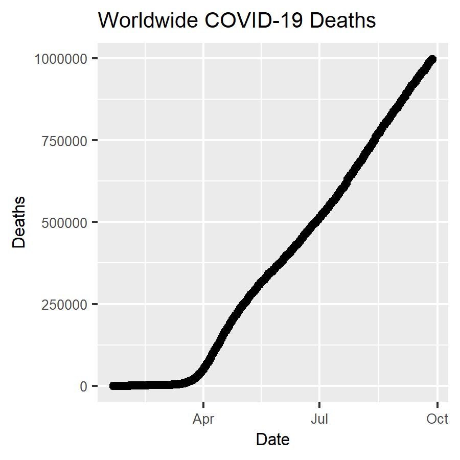

```{r setup, include=FALSE}
knitr::opts_chunk$set(echo = TRUE)
```

```{r}
library(tidyverse)
library(lubridate)
```

## Challenge 1
Print a graph (different from the one above) to a png file using 3*ppi for the height and width and display the png file in the report using the above R Markdown format.

```{r}
time_series_deaths <- read_csv("data/time_series_covid19_deaths_global.csv")%>%
  rename(Province_State = "Province/State", Country_Region = "Country/Region")

time_series_deaths_long <- time_series_deaths %>% 
  pivot_longer(-c(Province_State, Country_Region, Lat, Long), names_to = "Date", values_to = "Deaths")
```

```{r}
time_series_deaths_long$Date <- mdy(time_series_deaths_long$Date)
```


```{r, eval = FALSE}
ppi <- 300
png("images/time_series_worldwide_death.png", width=3*ppi, height=3*ppi, res=ppi)
time_series_deaths_long %>% 
  group_by(Date) %>% 
  summarise_at(c("Deaths"), sum) %>% 
  ggplot(aes(Date, Deaths, group = 1)) + 
  geom_point() + 
  geom_line() + 
  ggtitle("Worldwide COVID-19 Deaths") + 
  theme(plot.title=element_text(size = 10), text=element_text(size = 8))
dev.off()
```
 


## Challenge 2
Turn one of the exercises from Lab 5 into an interactive graph with plotyly

```{r}
library(plotly)
```

```{r}
worldwide_deaths <- time_series_deaths_long %>% 
  group_by(Date) %>% 
  summarise_at(c("Deaths"), sum)

p <- ggplot(worldwide_deaths, aes(Date, Deaths, group = 1)) + 
  geom_point() + 
  geom_line() + 
  ggtitle("Worldwide COVID-19 Deaths")
ggplotly(p)
```


## Challenge 3
Create an animated graph of your choosing using the time series data to display an aspect (e.g. states or countries) of the data that is important to you.

```{r}
library(gganimate)
library(transformr)
theme_set(theme_bw())
```


```{r}
time_series_long_joined <- read_csv("data/time_series_long_joined.csv")

time_series_long_joined_plus <- time_series_long_joined %>% 
  mutate(Deaths_per_Confirmed = Deaths/Confirmed) %>% 
  select( , -c(3,4,7,8))

time_series_long_joined_plus$Deaths_per_Confirmed[is.nan(time_series_long_joined_plus$Deaths_per_Confirmed)] <- 0

head(time_series_long_joined_plus)
```

```{r}
time_series_long_joined_counts <- time_series_long_joined_plus %>% 
  pivot_longer(-c(Province_State, Country_Region, Date),
               names_to = "Report_Type", values_to = "Counts")
time_series_long_joined_counts$Date <- mdy(time_series_long_joined_counts$Date)
head(time_series_long_joined_counts)
```
```{r}
sk_data <- time_series_long_joined_counts %>% 
  group_by(Country_Region, Report_Type, Date) %>% 
  summarise_at(c("Counts"), sum) %>% 
  filter(Country_Region == "Korea, South")
p <- ggplot(sk_data, aes(x = Date, y = Counts, color = Report_Type, fill = Report_Type)) + 
  geom_point() + 
  geom_line() + 
  ggtitle("South Korea COVID-19 Cases") + 
  geom_point(aes(group = seq_along(Date))) + 
  transition_reveal(Date)
animate(p, end_pause = 15)
```